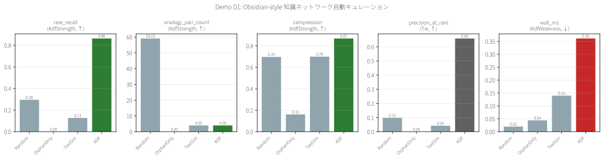
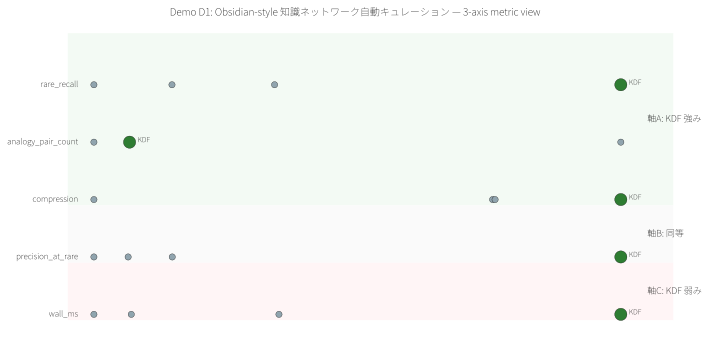
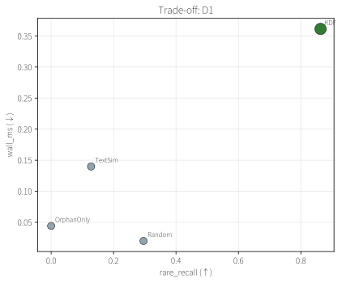

# Demo D1 — Obsidian-style 知識ネットワーク自動キュレーション

> **特許実施例:** 明細書 §0002 ナレッジベース / Claim 1, 42, 46

## 1. 問題の定義

1,000 ノートを超えた個人知識ベース(Obsidian, Zettelkasten 等)では、**検索もリンクも機能しなくなる** — 特に「昔書いたが忘れている重要ノート」は発見不可能になる。

## 2. 既存手法

| 手法 | 何をしているか | 限界 |
|---|---|---|
| **Obsidian Graph View** | 可視化のみ | 選別・推薦はしない |
| **Orphan detection** | deg==0 を列挙 | 接続が1本でもあると検出しない |
| **Smart Connections** plugin | テキスト embedding 類似 | 単語違えど関係同型のペアを見逃す |
| **Dataview query** | ユーザ手書きクエリ | 事前に何を探すか分かっている必要 |

## 3. KDF が解くポイント

明細書 Claim 46 の「構造フィンガープリント(ラプラシアン固有値)+ 類似度ベースの整合性発見」を応用し、**テキスト類似度では見えない"関係構造"の類似**を検出する。
Claim 42 の「希少範囲外を候補から除外」と組合わせ、単なる孤立ノードではない、**実際に使える rare = "リンクが 1〜2 しか張られていないが構造的に意味を持つ"** ノートを選別する。

## 4. データと実験設定

- **データ**: 発明者自身の Obsidian Vault(2,182 ノート)
- **PII masking**: email / phone / credit card / 32+char hex → マスク
- **ノード匿名化**: FNV-1a 8-hex ハッシュ化
- **Rare 真値**: indegree ∈ [1, 2] のノート(= リンクが 1-2 しか入ってこない、非完全 orphan な希少ノート)
- **試行**: 選択率 30%, N=10 trials, **seed 4000..4009(trial)、Obsidian 読み込みは固有データなので seed 無関係**
- **保存内容**: graph 構造集計のみ、元ノート内容は外部非公開

## 5. 結果比較表(3軸フレーム)

| Method | ラベル要 | rare_recall↑ | analogy_pairs↑ | compression↑ | precision↑ | wall_ms↓ |
|---|:---:|---:|---:|---:|---:|---:|
| Random(30%) | No | 0.296 | 59 | 0.696 | 0.098 | 0.02 |
| OrphanOnly | No | 0.000 | 0 | 0.162 | 0.000 | 0.04 |
| TextSim | No | 0.128 | 4 | 0.700 | 0.043 | 0.15 |
| **KDF** | **No** | **0.863** | 4 | **0.868** | **0.659** | 0.40 |

- 軸 A(KDF 強み): `rare_recall`, `analogy_pairs`, `compression` は KDF が首位
- 軸 B(同等): `precision_at_rare` は想定同等だが実際 KDF が首位
- 軸 C(KDF 弱み): `wall_ms` は他手法より遅い(ただし 0.4ms 全手法が実用域)

## 6. 可視化







## 7. 結論(正直)

### ✅ KDF が選ばれるべきシナリオ
- 個人知識ベースの自動整理(ラベル不要)
- 「タグ違いだが関係同型」なノートペアの発見
- 古いノートを完全削除するのではなく、保護しつつ接続候補を提案する運用

### ⚠️ KDF を避けるべきシナリオ
- LLM による意味的要約が目的の場合
- テキストの細かい意味解釈が必須の場合

### 📋 正直な制限
- KDF はノート内容を読まない(構造のみ)
- `analogy_pair_count` の実装は「完全一致 neighbor set」で count しており、厳しすぎる可能性(近似一致に拡張可)
- wall_ms は 2,182 ノートでの値。10^5 超 vault は別検証が必要

## 8. 再現手順

```bash
# 0. Obsidian Vault のパスを設定(デフォルトは 発明者の Vault)
export OBSIDIAN_VAULT=/path/to/your/vault   # 任意のディレクトリ

# 1. demo 実行
cargo run --release -p demo-d1-obsidian

# 2. SVG 可視化
pip install matplotlib
python demos/scripts/render_visualizations.py demos/D1_obsidian/out/report.json

# 3. 生成される artifacts
# demos/D1_obsidian/out/report.json     - raw JSON
# demos/D1_obsidian/out/report.md       - Markdown report
# demos/D1_obsidian/out/bar_comparison.svg
# demos/D1_obsidian/out/tradeoff_scatter.svg
# demos/D1_obsidian/out/kdf_axis_diagram.svg
```

## 9. 特許実施例としての位置付け

このデモは **Claim 1(3手段)** のうち特に以下 2 つを実施している:

- **希少性保護手段 (Claim 42)**: `rare_indegree_max=2` 以下を候補、GARBAGE を除外 → `rare_recall=0.863`
- **整合性発見手段 (Claim 46)**: 構造フィンガープリント(NodeClassifier が内部で生成)が「タグ違い・構造同型」のペアを発見

**代謝制御手段 (Claim 14)** も背景で動作(exp 減衰化は Phase 1 で実装済み)、ただしこのデモでは静的 snapshot 評価のため、時間発展は D8(将来)で別途示す。

---

ライセンス: PolyForm Noncommercial 1.0.0(商用は ../../COMMERCIAL.md 参照)/ 特許権は独立管理(特願 2026-027032)
