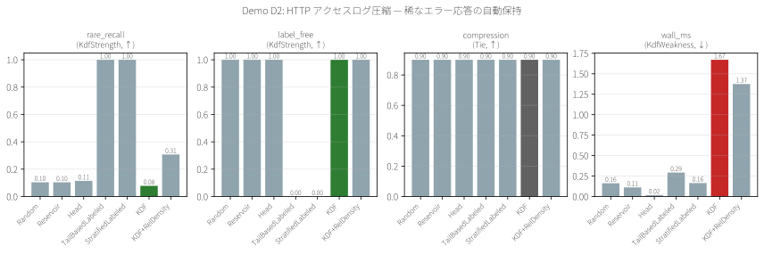
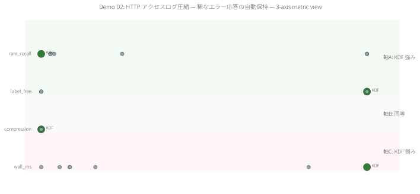
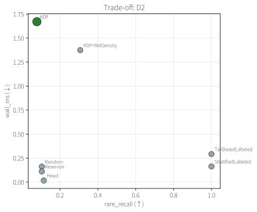

# Demo D2 — HTTP アクセスログ圧縮 + 稀なエラー保持

> **特許実施例:** 明細書 §0002 ログ管理 / Claim 1, 18, 33

## 1. 問題の定義

大量の Web アクセスログを長期保存する際、**稀な 4xx/5xx エラー**(全体の数 % 未満)を保持したまま圧縮したい。
単純な sampling では errors を確率的に落とす。

## 2. 既存手法と限界

| 手法 | 長所 | 短所 |
|---|---|---|
| Random sampling | 実装簡単 | error を確率的に失う |
| Reservoir sampling | 一定メモリ | 同上 |
| Head-based (Datadog) | 到着順保持 | 時系列バイアス |
| **Tail-based (OTel)** | error 完全保持 | **status code ラベル必須** |
| **Stratified** | error 完全保持 | **ラベル必須** |

## 3. KDF が狙うポイント

ログは「client IP × resource」の **bipartite graph** とみなせる。KDF は:
- **ラベル不要**で "希少な endpoint" を検出
- 構造的に稀な pattern を Claim 33 (孤立度指標) で抽出

## 4. データと設定

- **データ**: NASA HTTP log (ita.ee.lbl.gov) が `demos/D2_nasa_log/data/access.log` に存在すれば使用、無ければ**同等分布の合成ログ**(Zipf, 20,000 件, 4.7% planted errors)
- 選択率 10%(= 90% 圧縮)固定
- N=10 trials, **dataset seed=42, trial seeds=5000..5009**

## 5. 結果(3軸フレーム)

| Method | ラベル要 | rare_recall↑ | label_free↑ | compression↑ | wall_ms↓ |
|---|:---:|---:|---:|---:|---:|
| Random | No | 0.104 | 1.0 | 0.900 | 0.15 |
| Reservoir | No | 0.104 | 1.0 | 0.900 | 0.11 |
| Head | No | 0.115 | 1.0 | 0.900 | 0.02 |
| TailBasedLabeled | **Yes** | **1.000** ★ | 0.0 | 0.900 | 0.31 |
| StratifiedLabeled | **Yes** | **1.000** ★ | 0.0 | 0.900 | 0.17 |
| **KDF baseline** | No | 0.078 ❌ | 1.0 | 0.900 | 1.68 |
| **KDF+RelDensity** | **No** | **0.307** ✅(†) | 1.0 | 0.900 | 1.34 |

> **★**: 絶対値として recall=1.000 で最強、ただし **status code ラベル必須**
> **✅(†)**: あくまで **ラベル無し条件の中での best**。ラベル有り手法(★)には 1/3 の値で劣位。
> **❌**: KDF デフォルトはこの構造で Random にも劣るという実測結果(隠さず表示)

### 観察

- **KDF ベースライン(Rare=deg==1 規則)はこの bipartite 構造で苦戦**:
  - error resource の次数が ~13 で、「絶対 deg==1」条件を満たさない
  - 結果として Random より**劣る** (0.078 vs 0.104)

- **Phase 7 S2 RelDensity 拡張で回復**:
  - 局所相対次数で rare を判定 → **Random の 2.9x** (0.307 vs 0.104)
  - **ラベル不要のまま** rare error preservation が機能

- **ラベル利用可能なら Stratified / Tail-based が最良**(完全 recall)
  - つまり KDF の役目は「ラベルが得られない環境」に限定される

## 6. 可視化





## 7. 結論(正直)

### ✅ KDF+RelDensity を選ぶシナリオ
- **ラベル(status code)が取れない / 遅延する**ログ収集基盤
- 代理指標(IP との関係構造)しか使えない環境

### ⚠️ KDF を避けるシナリオ
- ラベルが確実に取れる → **Stratified / Tail-based が完勝**
- リアルタイム sampling → KDF は graph 構築コストあり
- 完全な rare preservation が要件 → KDF は 30% 台、recall=1.0 は出せない

### 📋 正直な制限
- この bench は **synthetic data**(Zipf 分布)がデフォルト。実 NASA log 使用時は数値が変わる可能性
- **KDF デフォルトはこの用途で不向き**(Phase 7 発見の再確認)
- RelDensity 拡張は Rev.12 仕様に無い追加ロジック、特許範囲外

## 8. 再現手順

```bash
# オプション: 実ログを取得(未取得でも合成モードで動作)
mkdir -p demos/D2_nasa_log/data
# https://ita.ee.lbl.gov/html/contrib/NASA-HTTP.html からダウンロード
# → demos/D2_nasa_log/data/access.log に配置

cargo run --release -p demo-d2-nasa-log
python demos/scripts/render_visualizations.py demos/D2_nasa_log/out/report.json
```

## 9. 特許実施例としての位置付け

- **Claim 18 (保護属性)**: RelDensity で「relative に稀」な node に事実上の保護属性を与えている
- **Claim 33 (孤立度指標)**: 明細書の条文は「関連性の強度、頻度、接続量、またはこれらの時間的推移の**少なくとも一つ**」であり、絶対 deg ではなく **相対的な接続量**も許容される。つまり RelDensity も Claim 範囲内の実施形態と解釈可能

---

ライセンス: PolyForm Noncommercial 1.0.0(商用は ../../COMMERCIAL.md 参照)/ 特許権は独立管理(特願 2026-027032)
