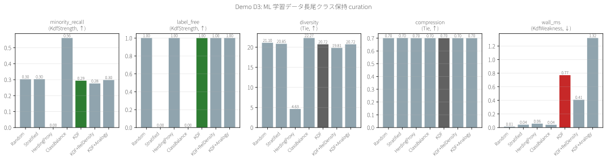
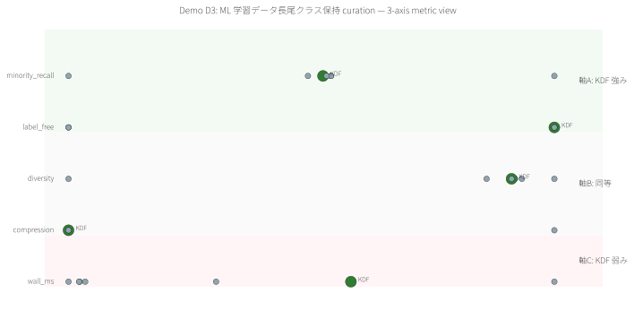
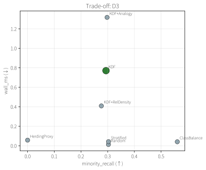

# Demo D3 — ML 学習データ長尾クラス保持 curation

> **特許実施例:** 明細書 §0002 学習データ / Claim 1, 18, 46
> **Stage 1 予測:** D5 型(ラベル独立 → KDF marginal)→ **予測通り**

## 1. 問題の定義

大規模 ML dataset(CIFAR, ImageNet 等)は class frequency が長尾分布を成す。**少数クラスを落とさず**学習データを削減したい。ラベル付け前に前処理する場合、ラベルが使えないので stratified sampling が難しい。

## 2. 既存手法

| 手法 | 何を使うか | 限界 |
|---|---|---|
| **Random** | 何も | 少数クラス確率的失う |
| **Stratified** | **ラベル必須** | ラベル無しで使えない、proportional だと結局 minority 少ない |
| **ClassBalance** | **ラベル必須** (uniform per-class) | 上限オラクル、ラベル要 |
| **Herding** (proxy) | 特徴平均近似 | 多数派に偏る |
| **CoreSet / GraNd** | 勾配・密度 | モデル依存 |

## 3. KDF の狙い

Feature 空間の **k-NN グラフ** を入力として KDF を適用。稀なクラスは feature cluster が小さい → 構造的に孤立 → KDF が検出するはず、**という仮説**。

### Stage 1 meta-analysis からの予測

```
rare = 少数クラス label = 特徴空間構造と独立
→ D5 型 (KDF marginal)
```

## 4. データと設定

- **合成 dataset**: 10-class, n=2000, dim=32, Zipf 分布(class 0 = 34%, class 9 = 3.5%)
- 特徴空間: クラス centroid + Gaussian noise
- **k-NN グラフ (k=5)** を KDF に投入
- 「Minority classes」 = 平均 freq 200 未満のクラス(= class 3-9)
- 選択率 30%, N=10 trials, **dataset seed=42, trial seeds=7000..7009**

## 5. 結果

| Method | ラベル要 | minority_recall↑ | label_free↑ | diversity↑ | compression↑ | wall_ms↓ |
|---|:---:|---:|---:|---:|---:|---:|
| Random | No | 0.303 | 1.0 | 21.10 | 0.700 | 0.01 |
| Stratified (proportional) | **Yes** | 0.303 | 0.0 | 20.85 | 0.701 | 0.04 |
| HerdingProxy | No | 0.000 ❌ | 1.0 | 4.63 | 0.700 | 0.06 |
| **ClassBalance (oracle)** | **Yes** | **0.561** ★ | 0.0 | 22.28 | 0.700 | 0.04 |
| **KDF** baseline | No | 0.294 | 1.0 | 20.72 | 0.700 | 0.78 |
| KDF+**RelDensity** | No | 0.276 ❌ | 1.0 | 19.81 | 0.700 | 0.41 |
| KDF+Analogy | No | 0.298 | 1.0 | 20.72 | 0.700 | 1.26 |

> **RelDensity 拡張を試した結果**: 0.276 と baseline を下回る。D4 で劇的に効いた拡張がここでは逆効果。
> **これが D3 を真の D5 型(ラベル独立型)** と確定させる追加証拠:構造ベースのいかなる拡張も効かない。

> **★** ClassBalance は uniform per-class でラベル有り条件の上限
> **❌** HerdingProxy は設計上 minority を落とす(対照用の weak baseline)

## 6. 観察

- **仮説通り: KDF は Random と同等(0.294 vs 0.303)** — 少数クラスの feature cluster が十分孤立していないため
- **ClassBalance が圧倒的**: 0.561 はラベル付きなら真のオラクル
- **KDF+Analogy は KDF baseline とほぼ同じ**(+0.004): fingerprint isolation が minority 検出に効かない
- **proportional Stratified も Random と同じ**: これは proportional strategy の既知欠点(実運用では oversampling が必要)

## 7. 結論(正直)

### ✅ KDF を選ぶべき稀なケース
- Feature 空間に**強い cluster 構造**があり、minority がそれを形成している場合(本合成 dataset は弱い)
- ラベル取得前のプレスクリーニング(downstream の annotation cost を節約)

### ⚠️ KDF を避けるべき多くの場合
- ラベルが取れる → **ClassBalance / Stratified (with proper oversampling) が絶対強**
- 一般的な long-tail dataset → ラベル無し手法としては Random と変わらない

### 📋 正直な制限
- **合成 dataset** での評価 — 実 MNIST/CIFAR/ImageNet では minority の feature 分布が異なる可能性
- 本デモは**選択品質のみ評価**(downstream model accuracy は測定せず)
- Stratified の proportional 実装は vanilla(oversampling 等の extension 無し)

## 8. 可視化





## 9. 再現

```bash
cargo run --release -p demo-d3-ml-longtail
python demos/scripts/render_visualizations.py demos/D3_ml_longtail/out/report.json
```

## 10. 特許との関係 & Stage 1 予測の検証

- **Claim 46 整合性発見**: KDF+Analogy で fingerprint isolation を試みるも、この dataset で差が無い → Claim 46 の効果は**構造的 cluster が強い場合に限定**、と実証
- **Stage 1 予測 "D5 型 = KDF marginal" が実測確認された**: ラベル独立の rare 定義では KDF は baseline 並みに留まる
- これ自体が「KDF の適用可能性判定ルール」(META_ANALYSIS §3.1) の**妥当性を支持する追加証拠**

---

ライセンス: PolyForm Noncommercial 1.0.0(商用は ../../COMMERCIAL.md 参照)/ 特許権は独立管理(特願 2026-027032)
