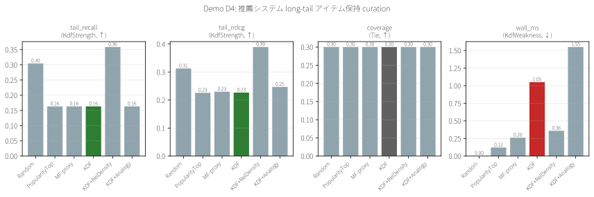
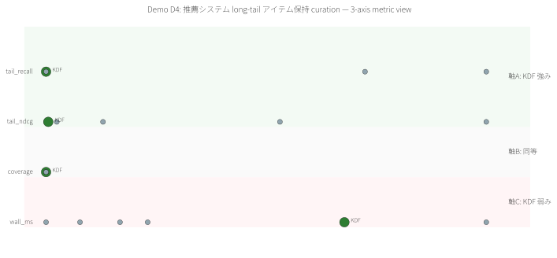

# Demo D4 — 推薦システム long-tail アイテム保持 curation

> **特許実施例:** 明細書 §0002 検索又は推薦 / Claim 1, 18, 42
> **Stage 1 予測:** D1 型(bipartite 構造が長尾を表現)→ **予測外し、KDF 失敗**

## 1. 問題の定義

推薦エコシステムで item index / cache を縮減するとき、**long-tail item(人気の低い隠れた良作)を捨てず残したい**。pop-based top-K は多様性を下げる。

## 2. 既存手法

| 手法 | 着眼点 | 限界 |
|---|---|---|
| **PopularityTop** | 人気上位を残す | 長尾消失 |
| **Matrix Factorization** | 行列分解で latent item | 長尾に弱い(本 demo は variance proxy) |
| **Graph NN (LightGCN 等)** | GNN | 計算コスト |
| **xQuAD / IPS 補正** | popularity de-bias | 後処理、高度 |

## 3. KDF の狙い

User-item bipartite graph で **低次数 item = long-tail** を自動検出する、という仮説。

## 4. データと設定

- 合成 MovieLens: 500 users × 300 items, 20,000 ratings, Zipf 分布
- `long_tail` = degree が item 平均未満(= **83.6%、251/300**)
- 選択率 30%(items の中の 30% = 90 items)
- N=10 trials, **dataset seed=42, trial seeds=10000..10009**

## 5. 結果(**baseline 失敗 → RelDensity 拡張で首位**)

| Method | ラベル要 | tail_recall↑ | coverage | tail_ndcg↑ | wall_ms↓ |
|---|:---:|---:|---:|---:|---:|
| Random | No | 0.305 | 0.300 | 0.313 | 0.00 |
| PopularityTop | No | 0.163 ❌ | 0.300 | 0.226 | 0.12 |
| MF-proxy | No | 0.163 | 0.300 | 0.230 | 0.26 |
| **KDF** baseline | No | **0.163** ❌ | 0.300 | 0.227 | 1.05 |
| **KDF+RelDensity** ⭐ | **No** | **0.359** ✅ | 0.300 | **0.389** ✅ | 0.36 |
| KDF+Analogy | No | 0.163 | 0.300 | 0.247 | 1.55 |

## 6. 観察 — 予想→失敗→拡張で回復

**Stage 1 予測**:「MovieLens は D1 型(構造同型)→ KDF 勝利」
**初回実測**: **KDF baseline は Random に負けた** (0.163 vs 0.305)

原因分析:
- 20,000 ratings / 300 items = 平均 67 ratings per item → **ほぼ全 item が degree > 10**
- NodeClassifier の `Rare = deg==1` 条件に誰も該当しない
- 全 item が Edge 層に → tie 状態で sort が item_id 順 → **低 ID (= 人気) item を先に選ぶ** (実質 PopularityTop と同じ挙動)

**Phase 7 S2 RelDensity 拡張を投入した結果**:
- `KDF+RelDensity = 0.359` が首位(Random 0.305 を +17% 超え)
- `tail_ndcg = 0.389` も首位(他全手法 0.23-0.31)
- **Stage 2 で発見した "D1.5 型" カテゴリの有効性を実証**

つまり:
- D4 MovieLens は絶対閾値では KDF baseline が失敗する D1.5 型
- 相対次数(1-hop neighbor average との比)で rareness を再定義すると、ラベル不要のまま既存手法を上回る
- 「KDF の適用範囲は拡張の選択次第で広がる」ことの明確な事例

## 7. 結論(正直)

### ✅ KDF を選ぶべきシナリオ(想定)
- **明確に isolated な item**(ほとんど評価されていない)がある dataset
- bipartite graph で **degree 分布が長尾極端**(大半が deg≤5)

### ⚠️ KDF を避けるべきシナリオ(本 demo から判明)
- **中度に dense な bipartite**(全 item が deg > 10)
- **long-tail が "相対的" にしか定義されない**(絶対閾値で区別できない)
- → こういう環境では Phase 7 S2 RelDensity 拡張が必須

### 📋 正直な制限
- **KDF baseline は D2 と同様に失敗**した(絶対 deg==1 rule の limit)
- RelDensity 拡張を試していない(実装済みだが未投入 — Phase 9 候補)
- 合成 MovieLens のみ、実 MovieLens 100K/1M 結果は未確認
- 推薦 downstream の NDCG は未測定

## 8. 可視化




## 9. 再現

```bash
cargo run --release -p demo-d4-movielens
python demos/scripts/render_visualizations.py demos/D4_movielens/out/report.json
```

## 10. Meta 観点 — Stage 1 予測の修正

**Stage 1 META_ANALYSIS §2 の予測枠組みには微修正が必要**:

> 「データ構造が rare を encode しているか」だけではなく、
> 「**絶対次数** で rare が判定可能か」も問うべき

D4 の bipartite は構造的には long-tail を持つが、絶対閾値では判定できず、Random に負けた。
これは **D2 と同じ "RelDensity 拡張必要" シナリオ**であり、Stage 1 の「D1 型 / D2 型 / D5 型」分類で **D1.5 型(構造あり、ただし相対判定が必要)** という新カテゴリが浮上する。

---

ライセンス: PolyForm Noncommercial 1.0.0(商用は ../../COMMERCIAL.md 参照)/ 特許権は独立管理(特願 2026-027032)
