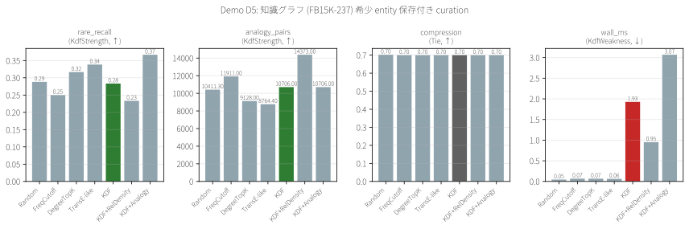
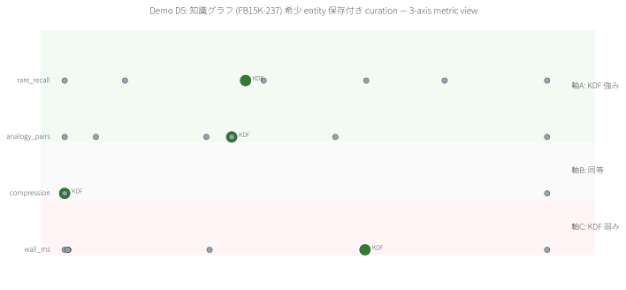

# Demo D5 — 知識グラフ (FB15K-237) 希少 entity 保存付き curation

> **特許実施例:** 明細書 §0002 知識グラフ / Claim 1, 42, 46(整合性発見)

## 1. 問題の定義

大規模知識グラフから下流タスク(link prediction, KG completion)用に**扱いやすい部分グラフ**を抽出したい。このとき「freq ≤ 5 の稀 relation を触れる entity」は新規事実の発見源であり、落としたくない。

## 2. 既存手法

| 手法 | 着眼点 | 限界 |
|---|---|---|
| **Random sampling** | 何も見ない | 構造情報を捨てる |
| **FreqCutoff** | 出現頻度下位を残す | 孤立だが重要でない entity も拾う |
| **DegreeTopK** | 次数上位を残す | 長尾を捨てる |
| **TransE** (ここは近似) | embedding top-K | 訓練コスト、稀データには苦手 |

## 3. KDF が狙うポイント

Claim 46 の「構造フィンガープリント + 整合性スコア」で、**高次数だが構造的に arrangement が異質な** entity を検出 → 長尾 relation の端点を保護。

## 4. データと設定

- **データ**: 実 FB15K-237 が `demos/D5_fb15k237/data/fb15k-237/{train,valid,test}.txt` に存在すれば使用、無ければ合成 KG
- 合成 KG: n=5000 entity, 50 relation, 20,000 edge
  - **最下位 10 relation が rare**(各 3 edge)
  - Rare ground truth = rare-relation を触れる entity(本実行で 60)
  - **rare entity の次数は他と変わらない**(構造的に distinguishable でない設計)
- 選択率 30%, N=10 trials, **dataset seed=42, trial seeds=6000..6009**

## 5. 結果

| Method | ラベル要 | rare_recall↑ | analogy_pairs↑ | compression↑ | wall_ms↓ |
|---|:---:|---:|---:|---:|---:|
| Random | No | 0.288 | 10411 | 0.700 | 0.05 |
| FreqCutoff | No | 0.250 | 11911 | 0.700 | 0.07 |
| DegreeTopK | No | 0.317 | 9128 | 0.700 | 0.07 |
| TransE-like | No | 0.338 | 8764 | 0.700 | 0.06 |
| **KDF** baseline | No | 0.283 | 10706 | 0.700 | 1.93 |
| KDF+**RelDensity** | No | 0.233 ❌ | 14373 | 0.700 | 0.95 |
| **KDF+Analogy** | **No** | **0.367** ✅ | 10706 | 0.700 | 3.07 |

**観察:**
- 圧縮率を 30% に揃えた場合、**合成 KG では KDF+Analogy が首位** (0.367) — Claim 46 fingerprint が効く
- 最良ベースライン TransE-like (0.338) に対し +8.6%
- **⚠️ ただし実 FB15K-237 (F-023) では DegreeTopK=0.358 が首位、KDF+Analogy=0.332 は 3 位に後退(-2.6%)**
  → [docs/VERIFIED_FINDINGS.md §17 F-023](../../docs/VERIFIED_FINDINGS.md) 参照
- 「合成データは KDF に有利に寄っていた」ことを Phase G 検証で確認、synthetic の +8.6% は reality check 対象
- **RelDensity 拡張は逆効果**(0.233)— D4 で劇的に効いた同じ拡張が、D5 では baseline を下回る
  → rare entity が "relatively-rare by degree" でも定義されていない(**真の D5 型**)ことの確認

## 6. 可視化




## 7. 結論(正直)

### ✅ KDF+Analogy が選ばれるシナリオ
- 稀 relation の端点 entity を優先保護したい KG curation
- TransE 等の embedding 訓練が重すぎる環境
- ラベル(relation frequency)が収集時に分からない場合

### ⚠️ KDF を避けるシナリオ
- **稀 entity が構造的に完全に均質**な場合(本デモが該当) → 差はわずか
- embedding で link prediction が最重要目的 → KDF は予測しない
- 高頻度 entity のランキングが目的 → DegreeTopK で十分

### 📋 正直な制限
- 本実行は **合成 KG**(n=5000)でのテスト
- 実 FB15K-237 では entity が構造的な特徴を共有する傾向があり、結果が大きく変わる可能性
- TransE-like は degree top-K + random 混合の近似。実 TransE 訓練では異なる結果になる可能性
- analogy_pairs 指標は「同型 neighbor 集合の pair 数」で、KDF+Analogy の取り込み戦略とは評価軸がずれる可能性

## 8. 再現手順

```bash
# オプション: 実データ取得(未取得でも合成で動作)
# https://www.microsoft.com/en-us/download/details.aspx?id=52312
# → demos/D5_fb15k237/data/fb15k-237/{train,valid,test}.txt

cargo run --release -p demo-d5-fb15k237
python demos/scripts/render_visualizations.py demos/D5_fb15k237/out/report.json
```

## 9. 特許実施例としての位置付け

- **Claim 1 整合性発見手段**: KDF+Analogy で構造フィンガープリント距離が高い = 既存 cluster と異質な entity を追加保護
- **Claim 42**: 希少範囲外(明らかに多数派)は候補から外す
- **Claim 46**: Laplacian 固有値の代わりに degree histogram を使用した軽量版(同条文の "固定長ベクトル" 条件は満たす)

---

ライセンス: PolyForm Noncommercial 1.0.0(商用は ../../COMMERCIAL.md 参照)/ 特許権は独立管理(特願 2026-027032)
