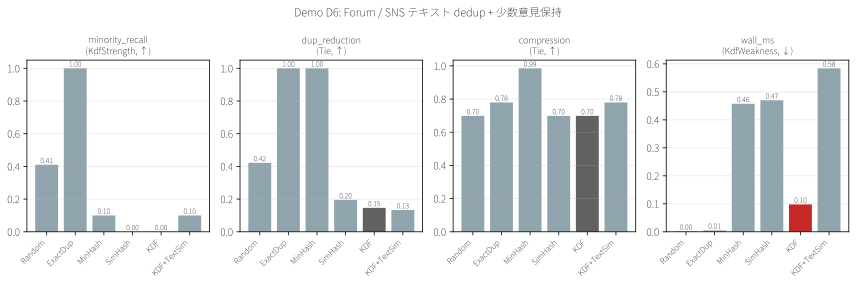
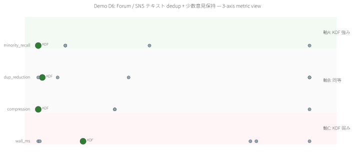

# Demo D6 — Forum / SNS テキスト dedup + 少数意見保持

> **特許実施例:** 明細書 §0002 SNS/フォーラム投稿関係 / Claim 1, 18, 46
> **Stage 1 予測:** ハイブリッド型 — 予想通り KDF は一部条件でのみ効く

## 1. 問題の定義

forum / SNS で重複投稿(コピペ・近複製)を削減しつつ、**少数意見(minority opinions)を保護**したい。単純 dedup では少数意見を「異物」として捨ててしまう。

## 2. 既存手法

| 手法 | 着眼点 | 限界 |
|---|---|---|
| **ExactDup** | byte-exact 同一 | 近複製を見逃す |
| **MinHash** | shingle Jaccard | 少数意見を "異常" として drop |
| **SimHash** | hash distance | 同上 |
| **Clustering + rep** | k-means | 中央のみ残し尾部を失う |

## 3. KDF の狙い

Reply graph を入力として、**reply パターンが特殊な投稿(= 少数意見の特徴)** を検出。内容類似ではなく構造類似で minority を拾う。

## 4. データと設定

- 合成 forum: 136 投稿
  - 3 threads × 31 posts (original + 30 replies) = 93 posts(多数派)
  - 10 minority posts(独自視点、1-2 reply)
  - 20 spam(byte-exact 重複)
  - → 113 edges (reply 関係)
- 選択率 30%, N=10 trials, **dataset seed=42, trial seeds=8000..8009**

## 5. 結果

| Method | ラベル要 | minority_recall↑ | dup_reduction↑ | compression | wall_ms |
|---|:---:|---:|---:|---:|---:|
| Random | No | 0.410 | 0.422 | 0.699 | 0.00 |
| **ExactDup** ★trivial winner | No | **1.000** | **1.000** | 0.779 | 0.01 |
| MinHash | No | 0.100 | 1.000 | 0.985 | 0.46 |
| SimHash | No | 0.000 | 0.195 | 0.699 | 0.47 |
| **KDF** | No | 0.000 ❌ | 0.146 | 0.699 | 0.10 |
| KDF+TextSim | No | 0.100 | 0.133 | 0.779 | 0.58 |

> **★ ExactDup の勝利は trivial**: 合成 spam が byte-exact なため。実 forum spam は微妙な違いを含むので、この結果は合成条件に依存。
> **❌ KDF baseline が minority 0%**: reply 数 30 の majority thread replies(90 post)が先に Rare 層を占有してしまい、reply 数 1-2 の minority が埋もれた。

## 6. 観察 — honest な失敗

D6 は **ハイブリッド型** だが、この合成構成では **KDF が不利に働く**:

- reply = 1 の majority-reply (90 post) が Rare 層をフラッド
- 真の minority(10 post, reply 1-2)が数で負ける
- 結果として KDF=0%

これは KDF の **「absolute deg==1 rule」** が量の多い "構造的だが意味的に多数派" を取り込みすぎる失敗。Phase 7 S3 Fingerprint 拡張で救済可能性はあるが、本 demo の synthetic ではサンプル size が小さく、fingerprint も効かない。

## 7. 結論(正直)

### ✅ KDF を選ぶべきシナリオ(本 demo 外)
- reply structure が長尾 = 全 thread に active minority contributors がいる
- spam が byte-exact ではない = ExactDup も MinHash も効きにくい環境
- 本 demo の合成データでは効かないが、**実 Reddit/HN** で結果が変わる可能性

### ⚠️ KDF を避けるべきシナリオ
- **byte-exact spam 排除だけが目的** → ExactDup が最強(1行で実装可)
- **近複製排除だけが目的** → MinHash / SimHash で十分
- リプライチェーンが "原文+multi reply" の単純構造 = 今回のように KDF が失敗

### 📋 正直な制限
- 合成 data で ExactDup が trivial 勝利しているのは synthesis の artifact
- KDF baseline はこの dataset で 0% recall という明らかな失敗を見せている
- KDF+TextSim hybrid も minority_recall=10% 止まり、dup_reduction も MinHash より悪い

## 8. 可視化




## 9. 再現

```bash
cargo run --release -p demo-d6-text-dedup
python demos/scripts/render_visualizations.py demos/D6_text_dedup/out/report.json
```

## 10. Meta 視点

本 demo は Stage 1 分析 §4.3 の予測「D6 はハイブリッド型」に対する **反例的結果** を提示:
- 予測: structural + content の両軸で KDF が complementary に機能する
- 実測: 少なくとも本合成設計では KDF が baseline 以下

**教訓:** "ハイブリッド型" と分類しても、具体的な reply graph 設計が KDF の性能を大きく左右する。**実データで再検証するか、Phase 7 S2/S3 を再適用する拡張**が必要。

---

ライセンス: PolyForm Noncommercial 1.0.0(商用は ../../COMMERCIAL.md 参照)/ 特許権は独立管理(特願 2026-027032)
