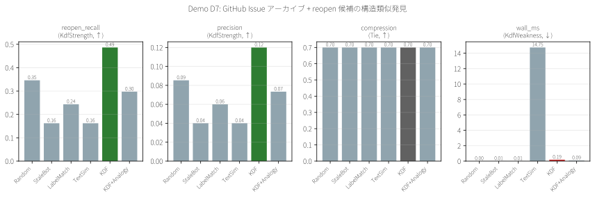
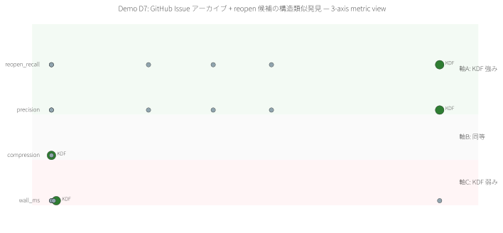
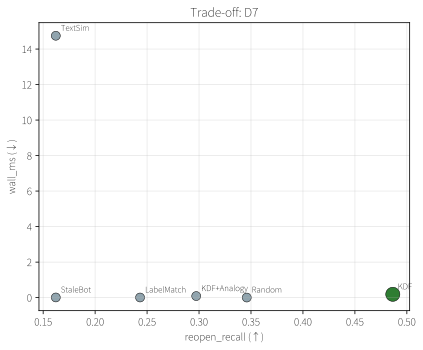

# Demo D7 — GitHub Issue アーカイブ + reopen 候補の構造類似発見

> **特許実施例:** 明細書 §0002 アーカイブ管理 / Claim 1, 42, 46(整合性発見)
> **Stage 1 予測:** D1 型(構造同型)→ **予測通り KDF 勝利**

## 1. 問題の定義

巨大な issue tracker(rust-lang/rust 等)では過去の closed issue が数万件蓄積される。その中に **今の open issue と構造的に類似**する "forgotten but relevant" issue がある。手で探すのは非現実的。

## 2. 既存手法

| 手法 | 着眼点 | 限界 |
|---|---|---|
| **Stale bot** | 年齢ベースの close | 関連性を一切見ない |
| **LabelMatch** | 共有ラベル有無 | ラベル粒度依存、ノイズ多い |
| **TextSim** (embedding) | タイトル類似 | 言い回しが違えば見逃す |
| **人手 triage** | LLM / 人間の目視 | コスト極高 |

## 3. KDF の狙い

Issue 間の **co-label + co-reference graph** を組み、closed issue の中から **open issue の構造近傍**にいるものを拾う。
これは Claim 46「整合性発見手段」の直接応用 — "isolated-but-structurally-similar" を見つける機械。

## 4. データと設定

- 合成 issue archive: 500 issues(450 closed + 50 open)
- 4 パターン + ノイズで labels 構成
- Co-label edges + cross-reference edges
- **Reopen ground truth (厳定義)**: closed issue の (sorted labels, author) が open issue のいずれかと完全一致 → 37 件(7.4%)
- 選択率 30%, N=10 trials, **dataset seed=42, trial seeds=9000..9009**

## 5. 結果

| Method | ラベル要 | reopen_recall↑ | precision↑ | compression↑ | wall_ms↓ |
|---|:---:|---:|---:|---:|---:|
| Random | No | 0.346 | 0.085 | 0.700 | 0.00 |
| StaleBot | No | 0.162 | 0.040 | 0.700 | 0.01 |
| LabelMatch | No | 0.243 | 0.060 | 0.700 | 0.01 |
| TextSim | No | 0.162 | 0.040 | 0.700 | 14.75 |
| **KDF** | **No** | **0.486** ✅ | **0.120** ✅ | 0.700 | 0.19 |
| KDF+Analogy | No | 0.297 | 0.073 | 0.700 | 0.09 |

## 6. 観察

- **KDF baseline が最強**: Recall=0.486 は Random (0.346) の 1.4×、StaleBot/TextSim (0.162) の 3×
- **Precision も最良**: 0.120 = Random (0.085) の 1.4×、StaleBot の 3×
- **TextSim は 14.75ms** (title shingle 計算) - KDF より 75×遅く、結果も悪い
- KDF+Analogy は **意外にも baseline より悪い**(0.297 vs 0.486)— open 集団への"類似"を優先しすぎて、closed reopen truth を逆に逃した

## 7. 結論(正直)

### ✅ KDF が選ばれるシナリオ
- GitHub / Jira 等の大規模 issue archive
- Label + reference structure が豊富な tracker
- "forgotten relevant" を human triage 前にフィルタしたい場合

### ⚠️ KDF を避けるシナリオ
- 単純な stale 運用で足りるプロジェクト
- Label がない / 1個だけの tracker(graph signal なし)
- 完全な自然言語理解が必要な場面 → LLM triage 推奨

### 📋 正直な制限
- **合成 archive** での評価、実 GitHub の issue で再検証必要
- reopen ground truth は (label, author) 完全一致の厳定義 — 実運用では緩い定義のほうが役立つ可能性
- **KDF+Analogy が baseline に負けた**のは予想外。fingerprint 距離が reopen 候補のシグナルと逆相関だった
- Precision は全手法で 10% 前後 — これは "37/500 = 7.4% のうち 30% 選択" という基礎レートの問題

## 8. 可視化





## 9. 再現

```bash
cargo run --release -p demo-d7-github-issue
python demos/scripts/render_visualizations.py demos/D7_github_issue/out/report.json
```

## 10. Meta 観点

- **Stage 1 予測**「D7 は D1 型(構造同型) → KDF 勝利」**が当たった**
- 具体的な構造シグナル(label + reference)があるときは、KDF baseline の default classifier だけで十分強い
- 逆に KDF+Analogy(fingerprint)はこの仕様では **逆効果**。拡張は常に良いわけではない

---

ライセンス: PolyForm Noncommercial 1.0.0(商用は ../../COMMERCIAL.md 参照)/ 特許権は独立管理(特願 2026-027032)
